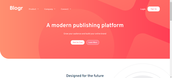
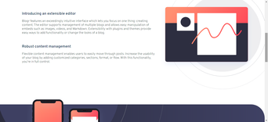
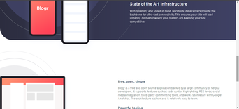
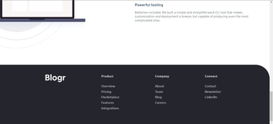
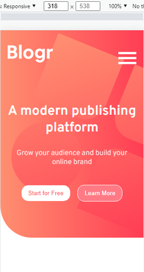
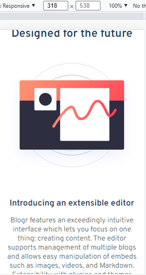
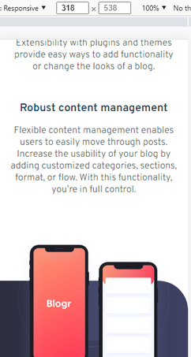
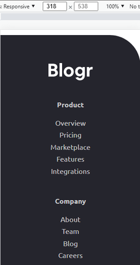

# Frontend Mentor - Blogr landing page solution

🚀Project Completed ✅

## Table of contents

- [Overview](#overview)
  - [About the project](#about-the-project)
  - [Functionalities](#functionalities)
  - [Screenshots](#screenshots)
  - [Links](#links)
- [How to use](#how-to-use)
- [My process](#my-process)
  - [Built with](#built-with)
  - [What I learned](#what-i-learned)
- [Author](#author)
- [License](#license)

## Overview 
### 💻 About the project

This project is a simple landing page made using HTML, SASS and JS and it's a solution to the [Blogr landing page challenge on Frontend Mentor](https://www.frontendmentor.io/challenges/blogr-landing-page-EX2RLAApP).  Frontend Mentor challenges help you improve your coding skills by building realistic projects. 

### ⚙️ Functionalities

Users are able to:

- [x] View the optimal layout for the site depending on their device's screen size
- [x] See hover states for all interactive elements on the page


### 🎨 Screenshots










### ⚓ Links

- [Live Site URL](https://your-live-site-url.com)
- [Challenge URL](https://www.frontendmentor.io/challenges/blogr-landing-page-EX2RLAApP)

## 🚀 How to Use

Before you start, you will need to install [Git](https://git-scm.com/) and also a powerful code editor like [Visual Studio Code](https://code.visualstudio.com/) to clone, test and modify this repository on your machine. To understand the code, you need to have basic knowledge of HTML, CSS, SASS and JavaScript.
There's no secret, after having cloned the project, to run it on your machine, just open the "index.html" file in any browser. But if you want to modify the sass files and automatically update the css files, just follow the steps below:

```bash
    # Clone the project (only if not already cloned)
    $ git clone https://github.com/Gustavo-Victor/blogr-landing-page-main.git

    # Enter the project folder
    $ cd blogr-landing-page-main/

    # Install sass on your machine globally 
    $ npm i -g sass 

    # Compile sass file to css file and automatically update
    $ npm run sass 

    # Now just open the 'index.html' file in any browser and start coding
```

## My process
### 🛠 Built with

- [HTML5](https://developer.mozilla.org/pt-BR/docs/Web/HTML)
- [SASS](https://sass-lang.com/)
- [JavaScript](https://www.javascript.com/)
### 🏅 What I learned

In this project I was able to reinforce my knowledge in CSS, SASS and JS in general.

The main topics of SASS are: nested rules, SASS declaratives like @use, @import, and @mixins.

As for JavaScript, the main reinforced knowledge is about events, constants, DOM, conditionals, loops and related things.

## 👤 Author

 <div class="social-media">
  <a href="https://www.instagram.com/gustav0_vbs/" target="_blank"></a>
 	<a href="https://twitter.com/GustavoVictorBS" target="_blank"></a>
  <a href = "mailto:gustavovbs270@gmail.com"></a>
  <a href="https://www.linkedin.com/in/gustavo-victor-575b93206/" target="_blank"></a> 
 <br/>
</div>

## 📝 License 

Copyright © 2022 Gustavo Victor.

This project is MIT licensed. Anyone can use and contribute to this project.